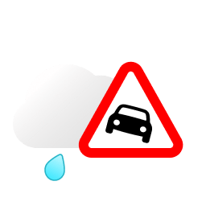
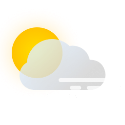
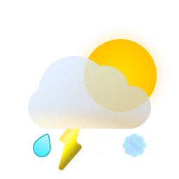
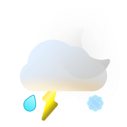
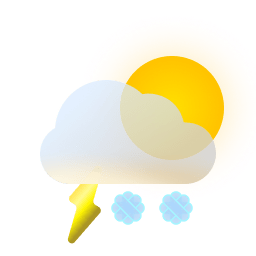
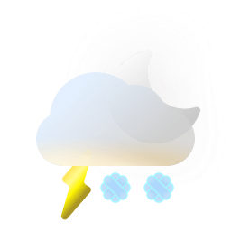
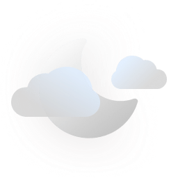
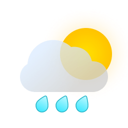
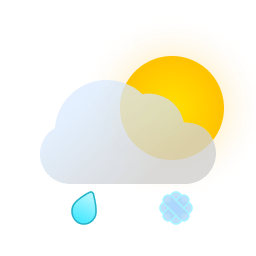
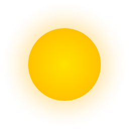

# IRM KMI Weather integration for Home Assistant

## Mapping between IRM KMI and Home Assistant weather conditions

| Condition       | Description                       | IRM KMI icon                                                                                                                                                                                                                                                                                        | IRM KMI data (`ww-dayNight`)                                                  |
|-----------------|-----------------------------------|-----------------------------------------------------------------------------------------------------------------------------------------------------------------------------------------------------------------------------------------------------------------------------------------------------|-------------------------------------------------------------------------------|
| clear-night     | Clear night                       |                                                                                                                                                                                                                                                      | `0-n`                                                                         |
| cloudy          | Many clouds                       |                                                                                                                                                       | `3-d` `3-n` `14-d` `14-n` `15-d` `15-n`                                       |
| exceptional     | Exceptional                       |                                                                                                                                                                                                     | `21-d` `21-n` `27-d` `27-n`                                                   |
| fog             | Fog                               |                                                     | `24-d` `24-n` `25-d` `25-n` `26-d` `26-n`                                     |
| hail            | Hail                              |                                                                                                                                                                                                                                                                                                     |                                                                               |
| lightning       | Lightning/ thunderstorms          |                                                                                                                                                                                                                                                                                                     |                                                                               |
| lightning-rainy | Lightning/ thunderstorms and rain |       | `2-d` `2-n` `5-d` `5-n` `7-d` `7-n` `10-d` `10-n` `13-d` `13-n` `17-d` `17-n` |
| partlycloudy    | A few clouds                      |                                                                                                                                                                                                       | `1-d` `1-n`                                                                   |
| pouring         | Pouring rain                      |                                                                                                                                                       | `4-d` `4-n` `6-d` `6-n` `16-d` `16-n` `19-d` `19-n`                           |
| rainy           | Rain                              |                                                                                                                                                                                                                                                     | `18-d` `18-n`                                                                 |
| snowy           | Snow                              |                                                                                                     | `11-d` `11-n` `12-d` `12-n` `22-d` `22-n` `23-d` `23-n`                       |
| snowy-rainy     | Snow and Rain                     |                                                                                                                                                       | `8-d` `8-n` `9-d` `9-n` `20-d` `20-n`                                         |
| sunny           | Sunshine                          |                                                                                                                                                                                                                                                      | `0-d`                                                                         |
| windy           | Wind                              |                                                                                                                                                                                                                                                                                                     |                                                                               |
| windy-variant   | Wind and clouds                   |                                                                                                                                                                                                                                                                                                     |                                                                               |